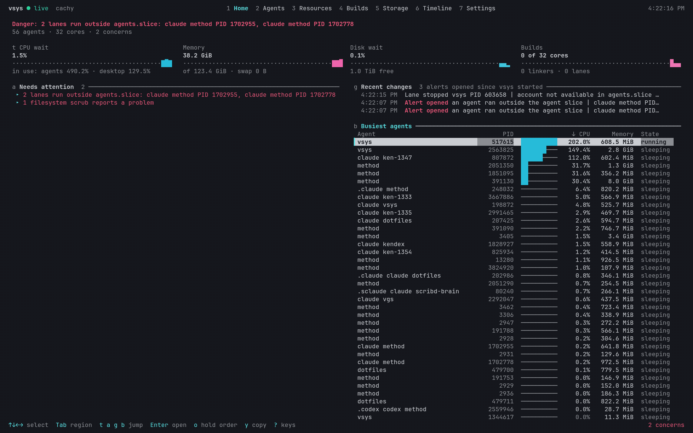

# vsys

vsys is a Linux terminal dashboard for people who run AI agents. It shows which work needs attention, where the machine's resources go, and what happened before a problem.



## Install

```sh
curl -fsSL https://raw.githubusercontent.com/vanillagreencom/vsys/main/install.sh | bash
```

The installer downloads the binary for your architecture, checks it against the release checksums, and puts it in `~/.local/bin`. Set `VSYS_INSTALL_DIR` to install somewhere else.

| Method | Command |
| --- | --- |
| Installer | `curl -fsSL https://raw.githubusercontent.com/vanillagreencom/vsys/main/install.sh \| bash` |
| Arch Linux (AUR) | `paru -S vsys`, or `paru -S vsys-git` to track the main branch |
| Release archive | Download `vsys-<tag>-linux-<arch>.tar.gz` from [Releases](https://github.com/vanillagreencom/vsys/releases) |
| From source | `bun install && bun run start` |

vsys needs Linux with cgroup v2. It does not run on macOS or Windows.

## Features

- Home: the verdict for the machine, tiles for CPU, memory, disk and builds with their history, and one card per current problem with its next step.
- Agents: every watched lane as a row with a CPU bar and a state, a search, and an optional full table.
- Agent detail: resources against limits, history charts, the processes, the launch and open files on request, and Freeze, Thaw and Stop for that lane.
- Resources: the machine's meters and the resource group tree, with idle groups hidden until asked.
- Builds: compile and link work against cores, cache hit rate, make token pools, and the building processes on request.
- Storage: bytes written per slice and per drive, drive lifetime writes, filesystems, scrub reports and scratch sizes.
- Timeline: charts over a chosen window, a time cursor, and what changed with its cause.
- Settings: what vsys can read on this machine, the sources it cannot, and every setting editable in place.
- A copy key that puts the selected command on the system clipboard through the terminal.
- A notice in the corner and a desktop notification when a serious problem appears.

## How it works

Home opens first, and its first line is the verdict: healthy, or the worst current problem. Select a card under Needs attention to read its detail and its next step, press `y` to copy the command it suggests, then press Enter to open the screen it points at.

Agents lists every lane. A lane name joins the account, the agent and the workspace, so two agents in one directory stay apart; every list also carries the process id in its own column, so two rows reading the same name are still two rows you can tell apart.

Timeline covers the last five minutes to the last day. It lists what changed and why: lanes starting and stopping, processes moving between resource groups, alerts opening and closing with how long they lasted, and each new verdict.

vsys reads system files with your permissions and changes nothing by default. It writes only your settings, optional history, and exports you ask for. With `writeMode` on, an agent detail can freeze, thaw or stop that lane, each after a confirmation that names the lane and shows the exact command.

The dashboard draws with the terminal's own sixteen colours. Red is serious, yellow is a warning, and the accent colour marks the selection and the active tab.

## Controls

The footer shows the keys for the current screen, and `?` lists them all.

| Action | Key |
| --- | --- |
| Open a screen | `1` to `7`, or click its tab |
| Next or previous region | `Tab` / `Shift+Tab` |
| Select a row | `↑` `↓` or `k` `j` |
| Open the selection, or unfold a section | `Enter` |
| Back to the list | `Esc` |
| Find an agent | `/` |
| List or full table | `d` |
| Choose table columns | `c` |
| Sort column and direction | `s` / `r` |
| Hold a list's order while the numbers move | `o` |
| Move the time cursor | `←` `→` or `h` `l` |
| Change the time window | `w` |
| Show the machine at the cursor | `p` |
| Copy the selected command | `y` |
| Export JSON or Markdown | `e` / `m` |
| Quit | `q` or Ctrl+C |

## Settings

Settings live in `~/.config/vsys/config.toml`, and the Settings screen edits every one of them in place. It groups them by what they change: display, history, thresholds, agents, builds, paths, program and keys.

| Setting | What it does |
| --- | --- |
| `writeMode` | Allows the Freeze, Thaw and Stop actions. Off by default. |
| `laneNameParts` | Chooses which parts name a lane, and in which order. |
| `persistence` | Saves history so you can replay an incident after a restart. Off by default. |
| `historyHours` | The window the timeline and the charts cover. |
| `watchedSlices` | The resource groups vsys treats as agent and desktop work. |
| `agentTools` | The program names that count as an agent. |

Storage reads drive lifetime writes from `smartctl -A` output left in a report directory by a privileged timer, because vsys runs no privileged helper of its own. Name each report after its device in `/sys/block`, so `/run/smartctl/nvme0n1.txt` matches the drive `nvme0n1`. A drive with no report is still listed, and says the figure is not available.

Run `vsys --help` for the snapshot and export options.

## Development

See [Development](DEVELOPMENT.md) for the checks and the test strategy, [the architecture overview](docs/architecture/overview.md) for the layer boundaries, and [Releasing](docs/RELEASING.md) for how a version is cut.

## License

[MIT](LICENSE)
