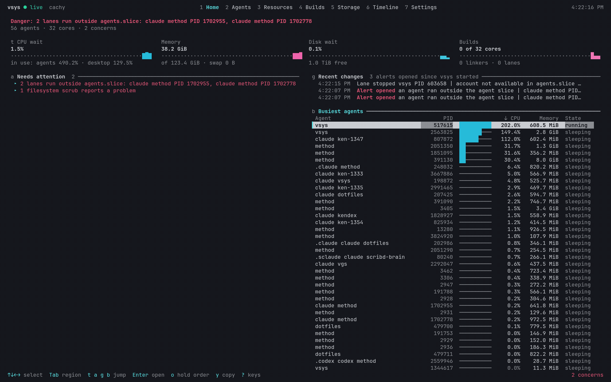

# vsys

vsys is a Linux terminal dashboard for people who run several AI agents or AI coding tools on one machine. It shows each agent with its Linux control group, systemd slice, build processes, and resource use.



## Install

```sh
curl -fsSL https://raw.githubusercontent.com/vanillagreencom/vsys/main/install.sh | bash
```

The installer downloads the correct release for your CPU. It checks the download and installs `vsys` in `~/.local/bin`. Set `VSYS_INSTALL_DIR` to use a different directory.

| Method | Command |
| --- | --- |
| Installer | `curl -fsSL https://raw.githubusercontent.com/vanillagreencom/vsys/main/install.sh \| bash` |
| Arch Linux | `paru -S vsys` |
| Arch Linux, main branch | `paru -S vsys-git` |
| Release archive | Download a Linux archive from [Releases](https://github.com/vanillagreencom/vsys/releases) |
| Source | `bun install && bun run start` |

vsys requires Linux with cgroup v2. It does not run on macOS or Windows.

The release archive, installer and Arch packages include the optional warden. Run `vsys warden install` if you want automatic agent correction. No package enables the warden for you.

## Features

- Lists each watched agent with its tool, account, worktree or branch, process ID, and tmux pane.
- Shows CPU, memory, swap, cache, disk I/O, task counts, resource pressure, and cgroup limits for each agent.
- Shows systemd slices and cgroups as a tree with their resource use and limits.
- Finds agents that run outside the configured agent slice or inherit a memory limit below the configured floor.
- Attributes compiler and linker processes to each agent, and shows active build jobs, GNU make job slots, and sccache use.
- Breaks disk writes down by systemd slice and storage device, and shows filesystem space, Btrfs errors, damaged files, scrub reports, drive lifetime writes, and scratch directory sizes.
- Records agent starts, stops, cgroup moves, resource alerts, and system resource history.
- Prints a cheap verdict summary for scripts with `vsys --once --summary`.
- Shows an agent's process tree, launch command, open files, and tmux output.
- Lets you change which slices, agent tools, build tools, resource thresholds, and columns it tracks.
- Can freeze, thaw, or stop an agent's systemd scope after you enable write mode and confirm the action.

## How it works

vsys reads Linux cgroup v2, process files, and configured system reports with your user permissions. It finds configured AI tools and watched systemd scopes. It groups their processes by cgroup and records resource use over time. It reads compiler, linker, build cache, and GNU make data from the same processes. `vsys --once --summary` takes two short-interval samples and skips scratch collection, so a flyout can read the current verdict without paying for a scratch scan. It can freeze, thaw, or stop a systemd scope only when write mode is on and you confirm the action.

## vsys observes; the warden corrects

The vsys dashboard reads system state and only changes a lane after you enable write mode and confirm the action. The optional agent warden is separate. It runs from a systemd user timer, moves escaped agent processes back into `agents.slice`, caps unbounded agent scopes, and stops abandoned harmful scopes.

Install the warden only when you want automatic correction. Run `vsys warden install` to write the systemd user units and enable the timer. Run `vsys warden status` to check the install. See [the warden architecture](docs/architecture/warden.md) for the requirements, and [the warden installer](docs/architecture/warden-install.md) for the installer rules and the owner-workstation migration notes.

## Settings

Settings are in `$XDG_CONFIG_HOME/vsys/config.toml`, or `~/.config/vsys/config.toml` when `XDG_CONFIG_HOME` is unset. Saved history and the filesystem error memory are in `$XDG_STATE_HOME/vsys/`, or `~/.local/state/vsys/`. While only the `~/.config/vsys/config.toml` or `~/.local/state/vsys/` copy exists, vsys keeps using it; quit vsys and move it to the `XDG_` location to switch. `~/.config/vsys/agent-tools.json` stays where it is, because the warden reads it there. You can edit settings from the Settings screen or in the file.

| Setting | What it changes |
| --- | --- |
| `watchedSlices` | The Linux resource groups that appear in the agent list. |
| `agentTools` | The program names that vsys treats as agents. The default comes from `data/agent-tools.json`. Settings saves machine-local additions in `~/.config/vsys/agent-tools.json`, which the warden also reads. A program counts as an agent only when its executable or script sits where that tool installs itself: a `paths` fragment, an `executables` path or a `mise` install directory its entry lists. For an agent installed somewhere else, add an overlay entry with the shipped name and the location, such as `{"name": "codex", "executables": ["/usr/local/bin/codex"]}`. A name you add in Settings carries no install location, so it matches by program name alone; add `paths` or `executables` to its entry in the overlay to match it only there. `vsys --once` shows a process whose name the locations rejected as `unconfirmedTool`. A program whose executable sits under a desktop install prefix in either file is a desktop app, not an agent, unless a bundled CLI suffix or that tool's install location names it. Shipped names cannot be removed from that overlay. A diverging hand-written `agentTools` value in `config.toml` still replaces the shared list for the dashboard. Lists equal to the shipped or layered names migrate away. |
| `laneNameParts` | The information used to name each agent. |
| `historyHours` | The time range available in charts and the timeline. |
| `persistence` | Saves history across restarts. It is off by default. |
| `notifications` | Selects the problems that send desktop notifications. |
| `writeMode` | Allows freeze, resume, and stop actions. It is off by default. |

Run `vsys --help` for command options.

## Storage checks

Storage says whether a filesystem's data is damaged, and when the disk was last checked. A filesystem that nothing has checked is never shown as healthy. The error counter alone cannot tell you: it counts reads that failed, so it stays still while nothing reads the damaged part.

Open a filesystem to see the files that may be damaged. On some kernels the check logs only where each damaged 64 KiB block starts, so a block can list the files at that start: a listed file may be sound, and the damaged file may not be listed. Restore damaged data from a backup or a snapshot.

vsys deletes nothing and offers no command to delete a listed file.

Checking a filesystem and naming its damaged files needs root, so vsys reads a report that the reporter writes as root after each Btrfs scrub, one file for each filesystem. vsys ships that reporter. Install it with:

```sh
curl -fsSL https://raw.githubusercontent.com/vanillagreencom/vsys/main/scripts/scrub-reporter/install | sudo bash
```

The installer refuses when the system has no `btrfs-scrub@.service` unit. Arch Linux's btrfs-progs package ships that unit. Fedora's and Ubuntu's btrfs-progs packages do not, so a reader on those distributions supplies the unit before this installer will proceed. It schedules no scrub. Enable a timer for each filesystem you want checked, for example `sudo systemctl enable --now btrfs-scrub@-.timer` for the root filesystem. Settings and Storage show the same install command while no report directory exists and the `scrubDir` setting is unchanged.

vsys also reads the kernel log, when your user can read the system journal. It shows when the kernel last logged a failed read and which inode it was in, with no reporter installed. Storage names the source of each time it shows: the scrub report, the error counter or the kernel log. See [storage integrity](docs/architecture/storage-integrity.md) for the report format.

## Drive lifetime writes

Reading a drive's lifetime writes with smartctl needs root, so vsys reads the reports a root timer leaves in `/run/smartctl`, one file for each drive. vsys ships that timer. Install it with:

```sh
curl -fsSL https://raw.githubusercontent.com/vanillagreencom/vsys/main/scripts/smart-reporter/install | sudo bash
```

The installer needs smartctl, from smartmontools. It starts an hourly timer, and the first report lands a minute after boot. Settings and Storage show the same install command while no report directory exists and the `smartDir` setting is unchanged.

Without the timer, vsys asks udisks2, which most desktops run, over the system bus without root. It gives the total for NVMe drives, and for SATA drives where udisks reports it in sectors. Storage names the source of each total: smartctl or udisks2. See [storage](docs/architecture/storage.md) for what each source gives.

## Development

See [Development](DEVELOPMENT.md) for local development and tests. See [Architecture](docs/architecture/overview.md) for the code structure. See [Releasing](docs/RELEASING.md) for the release process.

## License

[MIT](LICENSE)
